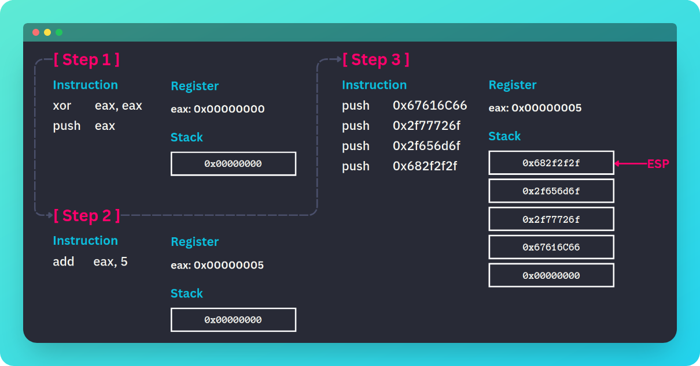

## ORW
**Keyword: System Call, Shellcode**

**Challenge URL:** https://pwnable.tw/challenge/#2

### Case Identification


The goal of this challenge is to read a flag file located at `/home/orw/flag` on the server, but with restrictions on which system calls can be used. There are only three syscalls allowed for this challenge: open, read, and write.

Let's examine the disassembled `main` function of the binary executable file. Here is the [full disassembled main](challenge/orw-disassembled-main.asm), here is the snippet:

```c
0x08048566 <+30>:	call   0x8048380 <printf@plt>
0x0804856b <+35>:	add    esp,0x10
0x0804856e <+38>:	sub    esp,0x4
0x08048571 <+41>:	push   0xc8
0x08048576 <+46>:	push   0x804a060
0x0804857b <+51>:	push   0x0
0x0804857d <+53>:	call   0x8048370 <read@plt>
0x08048582 <+58>:	add    esp,0x10
0x08048585 <+61>:	mov    eax,0x804a060
0x0804858a <+66>:	call   eax
0x0804858c <+68>:	mov    eax,0x0
0x08048591 <+73>:	mov    ecx,DWORD PTR [ebp-0x4]
0x08048594 <+76>:	leave  
0x08048595 <+77>:	lea    esp,[ecx-0x4]
0x08048598 <+80>:	ret    
```

- First, those instructions set up and call the `read` function.
- `0xc8` (200 in decimal) is pushed onto the stack, which is the maximum number of bytes to `read`.
- `0x804a060` is pushed onto the stack. This is the address of the buffer where the input will be stored.
- `0x0` (file descriptor for `stdin`) is pushed onto the stack.
- The read function is then called, which reads up to 200 bytes from `stdin` into the buffer at `0x804a060`.

```c
0x08048585 <+61>:	mov    eax,0x804a060
0x0804858a <+66>:	call   eax
```

**The key vulnerability** is the `call eax` instruction at `0x0804858a`. This instruction will execute whatever code is in the buffer at `0x804a060`, which is filled with user input. This is where the vulnerability lies. The program is taking the user's input, which was just read into the buffer at `0x804a060`, and executing it directly as code.


### Solution

**[Tap here](exploit/exploit2.py) for the solver script.**

Since our input will directly executed as code, we just need to put open, read, and write syscall in order to get the flag. Lets start by the `open` syscall in x86 assembly.

```c
xor eax, eax
push eax
add eax, 5
push 0x67616C66
push 0x2f77726f
push 0x2f656d6f
push 0x682f2f2f
mov ebx, esp
mov edx, 0
mov ecx, 0
int 0x80
```
On x86 assembly, the `open` syscall is used to open a file or create a new one. The `open` syscall reads the string from where `ebx` points (*we set `ebx` to point to the start of our string on the stack*) and keeps reading until it hits the null terminator. 
You can refer to [this article](https://github.com/W-zrd/Learn-Low-Level-Assembly?tab=readme-ov-file#system-call) for more detail. The C-equivalent code of the `open` syscall is:

```c
int open(const char *pathname, int flags, mode_t mode)
```

In assembly, you set up the syscall like this:

- eax: Syscall number (5 for `open`)
- ebx: Pointer to the **null-terminated string** of the pathname
- ecx: Flags (e.g., `O_RDONLY`, `O_WRONLY`, `O_RDWR`)
- edx: Mode (permissions, only used when creating a new file)

Actually, I have been stuck for hours working on `open` syscall. This is because at first I thought that the first three instructions of the payload is equals to `mov eax, 5`, so i can just replace those 3 instructions with `mov eax, 5`. Those ways are the same for storing 5 into the `eax` register, but it's actually wrong.

`xor eax, eax` is the preferred way because **it doesn't introduce null bytes which is important for crafting shellcode**. On the other hand, `mov eax, 5` translates to `\xb8\x05\x00\x00\x00` in machine code, **which contains null bytes**. In shellcode, we often need to avoid null bytes (`0x00`) because they can terminate strings. 

> **Null terminator** is a byte with the value 0 that marks the end of a string. It tells the system "the string ends here". When you pass a string to a syscall, it needs to know where the string ends. It keeps reading memory until it hits a null byte.

The `push eax` after `xor eax, eax` is crucial. It pushes the value in eax (which is 0) onto the stack, which serves as the null terminator for the filename string that will be constructed next.

Imagine if we didn't have the null terminator, The `open` syscall might try to open a file with a much longer, incorrect name, leading to errors or unexpected behavior. The `push eax` (when `eax` is 0) is indeed used for terminating the name of the file we're going to open.



Stack operations (`push`) and register operations (`add eax, 5`) are independent. The `add eax, 5` instruction is part of syscall preparation, not filename construction. The stack grows upwards and the program executes from top to the bottom (*The last item pushed is at the lowest address*). Pushing characters in reverse order creates the correct string when read from low to high addresses. Remember that the file is **Least Significant Byte** so the bytes order is also reversed as well. 

```c
/* Read Syscall */  
mov eax, 3
mov ecx, ebx
mov ebx, eax
mov edx, 38
int 0x80

/* Write Syscall */
mov eax, 4
mov ebx, 1
int 0x80
```

**The next syscall is about `read` and `write`**. It's much readable than the previous one. The key point of both syscall is about file descriptor. If you ever wondering like this:
> Why is the `fd` set to 3 instead of 0? i thought that `read` syscall is about reading input so i would use 0 for `stdin`. But why is it 3?

The reason is related to how file descriptors are assigned in Unix-like systems
- 0 is reserved for stdin (standard input)
- 1 is reserved for stdout (standard output)
- 2 is reserved for stderr (standard error)

When you open a new file with the open syscall, the kernel assigns the lowest available file descriptor number. Any subsequent files opened by a process get assigned the next available number, typically starting from 3, for the first file you open in a process. 

**We use 3 because we want to read from the file we just opened, not from stdin**. If we used 0, we'd be reading from stdin (keyboard input) instead of our flag file. In our exploit, we're specifically trying to read the contents of the flag file we just opened, not standard input. That's why we use the file descriptor returned by open (which is 3) instead of 0.

[Here is the solver script](exploit/exploit2.py) that i use to complete this challenge.