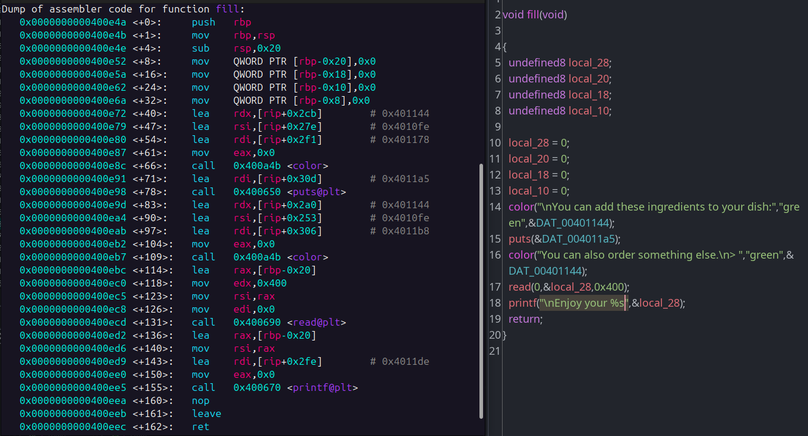
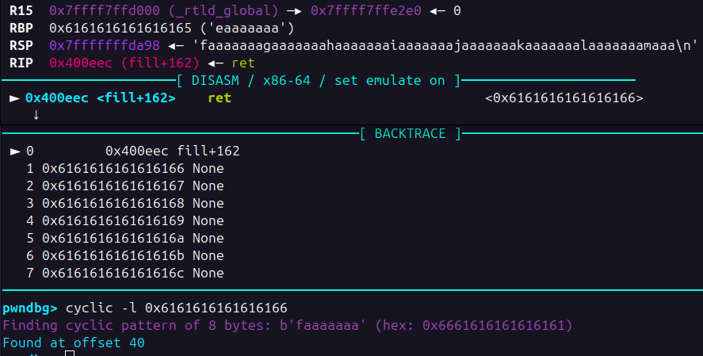
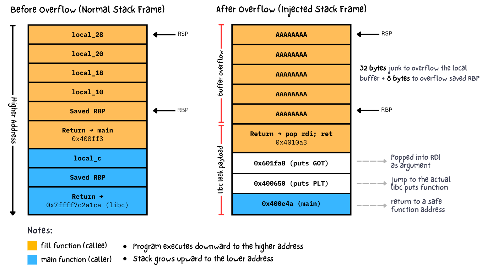
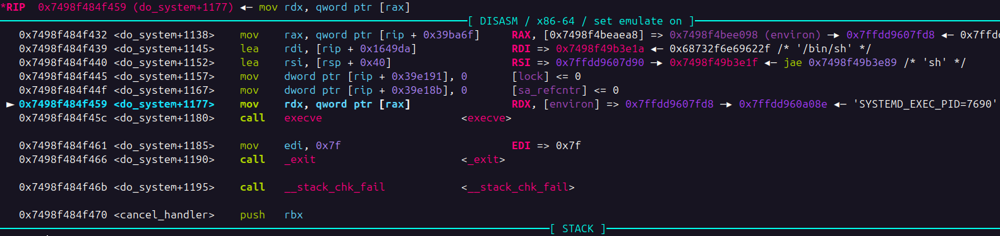
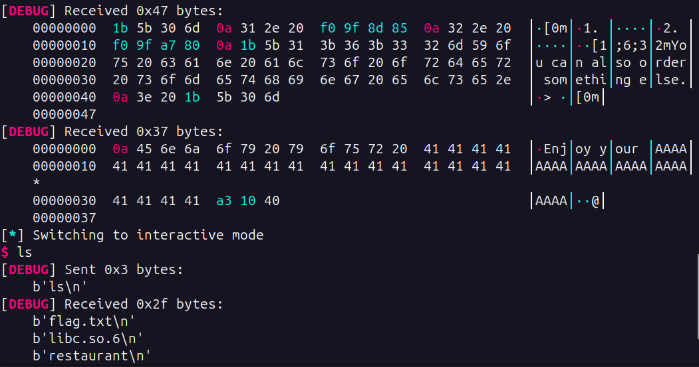

We are given a binary challenge, along with libc.so.6 file. Take a look at the binary protections:

```
    Arch:       amd64-64-little
    RELRO:      Full RELRO
    Stack:      No canary found
    NX:         NX enabled
    PIE:        No PIE (0x400000)
    Stripped:   No
```

We can't execute shellcode on the stack because the NX protection is enabled. And since the author give us the libc file, i guess there is something related about finding gadgets or ret2libc. After running and doing some trial & errors on the program, there is a potential vulnerability on user input when we choose "Fill my dish" option. 

> During the local exploit, i use pwninit to patch the binary for provided libc version. This tool is useful for automating binary exploit challenges that requires libc


The program will read user input and print out whatever value given by the user. We can use this as our entry point for doing analysis on pwndbg. What we do next is to find out the offset where the program will overflow.



Looking at the Ghidra decompiled code above, the vulnerable input we talked earlier is in the `fill` function. Let's setup breakpoint on the `fill` function before it hits return instruction which is at `<fill+162>`. To find out the offset, i often use built-in pwndbg pattern generator: `cyclic -n 8 100`. We use `-n 8` option because the architecture is 64 bit. After that, you'll find out that the offset is 40 bytes long.



What we got so far is that we can manipulate this return address to jump to whatever address we want by filling the input with 40 bytes of junk. But since there might be ASLR on the challenge server, how do we know the exact address of our target? which address should we point it to? or where should we redirect the execution?

Fortunately, the author also give us the exact build of libc.so.6 file which we can use to calculate the base address of any libc functions. We need to do this because the memory address of any libc functions will changed every time the program executes due to ASLR. 

Since we can't execute our code on the stack, our final goal is to spawn a shell by calling system call such as `execve()` or `system()` via ROP chaining. But before that, we need to calculate libc base address first to determine the exact address of `system()` function. In other words, there are 2 stage of exploits:

### Stage 1: Leak libc address
The goals is to defeat ASLR by discovering where libc is loaded in memory during program execution. Without Stage 1, you're blind. You know you want to call `system("/bin/sh")` to get a shell, but you have no idea where `system` is or where the string `/bin/sh` is because ASLR randomizes their locations every time the program runs. 

In order to leak libc address, we need to list up all known gadget that exist inside the binary. You can use one of the following:
```
ropper -f restaurant
```
```
ROPgadget --binary restaurant
```
```
objdump -M intel -d ./restaurant | grep "pop.*rdi"
```

On x86-64 Linux, functions receive their first argument via the `rdi` register (System V AMD64 ABI calling convention). When you want to call `puts(address)`, you need to put address into `rdi` before the call happens, so that's why we search for that gadget.

After you found the `pop rdi; ret` gadget, we can continue to craft stage 1 exploit. Here is the initial payload

```py
offset = 40
payload = b"a" * offset
payload += p64(pop_rdi_ret)
payload += p64(elf.got.puts)
payload += p64(elf.plt.puts)
payload += p64(main)
```

After the 40 bytes of junk, you place the address of a `pop rdi; ret` gadget. This instruction takes the next value from the stack (which we control) and puts it into the `rdi` register. In our case, we placed `got['puts']` right after the gadget address, so `rdi` now contains the address of the GOT entry for `puts`.


After `pop rdi` finishes, the next instruction in the gadget executes: `ret` (the 2nd `ret` based on the image above). This pops the next value from the stack into the `RIP` pointer and jumps there. What's the next value on the stack? It's whatever comes after `elf.got.puts` in our payload: `elf.plt.puts`.

The PLT is a stub that eventually calls the actual libc function. When you jump to `plt.puts`, it's essentially the same as calling the `puts` function. If you feel confused, take a look on the following stack frame layout visualization.



Here's where everything comes together. The `puts` function expects its first argument in the `rdi` register according to the x86-64 calling convention. And what's in `rdi` right now? The address `0x601fa8`, which is `got['puts']`.

So `puts` is being called with the argument `0x601fa8`. What does `puts` do? It treats its argument as a pointer to a string and prints the bytes at that address until it hits a null byte.


The memory at address `0x601fa8` contains the GOT entry for puts. This GOT entry holds the actual runtime address of the libc `puts` function. So `puts` reads this 8-byte address from `0x601fa8` and prints it out as raw bytes.


### Stage 2: Calculate libc base and Call system() function to spawn a shell

Once you have libc address, you can calculate the libc base, and from the base you can find `system` and `/bin/sh`. That's what Stage 2 will do, actually call `system("/bin/sh")` with the addresses you calculated. Here is the formula:

```
libc_base = leaked_address - puts_offset
system_address = libc_base + system_offset
binsh_address = libc_base + binsh_offset
```

After we got those 3 things, the next step is easy. We just need to repeat the stage 1 exploit, but the goal is to spawn a shell rather than calling libc functions. Based on the stage 1 exploit, The program has returned to main and is waiting for our input again. When `main` prompts us for input the second time, we send our Stage 2 payload:

```py
payload = b"a" * offset
payload += p64(ret)
payload += p64(pop_rdi)
payload += p64(next(libc.search(b"/bin/sh")))
payload += p64(libc.symbols.system)
```

Here, we add additional `ret` instruction for stack allignment because `system()` uses SSE instructions like `MOVAPS` that require the stack pointer to be aligned on a 16-byte boundary. Without this alignment, the program will crash with a segfault. Adding a single ret instruction can fix the alignment.


We need to load an argument into `rdi` before calling a function. In this case, we're calling `system(arg)`, where `arg` needs to be in `rdi`. Look at the image above. The `pop rdi` instruction takes the next value from the stack (which we've positioned to be the address of `"/bin/sh"`) and loads it into `rdi`. Now when system executes, it will receive the address of `"/bin/sh"` as its argument.

> [!TIP]
> When i mention `"/bin/sh"` it means the address where that string lives in libc memory, not the actual string `"/bin/sh"`.

When the `ret` pops this address into RIP, we jump to the actual `system` function code in libc. With rdi already containing the address of `"/bin/sh"`, it's as if we called `system("/bin/sh")`. After that, the end of `system` function will call `execve` as part of its operation.



We finally spawned a shell and got the `flag.txt`!

